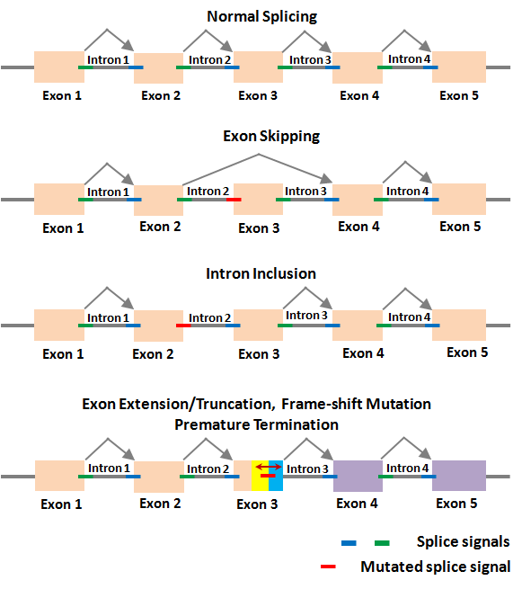

--- 
title: "<big>Docker Images:</big> The Solution for High-Dimensional Biological Datasets"
subtitle: "Practical User Guides For Reproducible Research"
date:
- <b>2024-03-13</b>
author: Teresia Mrema-Buza
site: bookdown::bookdown_site
documentclass: book
css: style.css
csl: 
  - library/apa.csl
bibliography:
  - library/packages.bib
  - library/references.bib
citation_package:
  - natbib
  - biblatex
  - amsplain
url: https://tmbuza.github.io/splice-junction/
cover-image: images/planning.png
email_address: "ndelly@gmail.com"
github-repo: tmbuza/splice-jucntion
biblio-style: apalike
description: |
  | This part will be added before release.
---


<!-- # Google fonts -->
<link rel="preconnect" href="https://fonts.googleapis.com">
<link rel="preconnect" href="https://fonts.gstatic.com" crossorigin>
<link href="https://fonts.googleapis.com/css2?family=Anton" rel="stylesheet">
<link href="https://fonts.googleapis.com/css2?family=Roboto:wght@100;300;400;500;700,900&display=swap" rel="stylesheet">
<link href="https://fonts.googleapis.com/css2?family=Oswald:wght@300;400;700&display=swap" rel="stylesheet">
<link href="https://fonts.googleapis.com/css2?family=Merriweather:wght@300;400;700&display=swap" rel="stylesheet">
<link href="https://fonts.googleapis.com/css2?family=Montserrat:wght@100;200;300;400;700&display=swap" rel="stylesheet">

<!-- # CSS -->
<link rel="stylesheet" href="https://cdnjs.cloudflare.com/ajax/libs/font-awesome/5.15.3/css/all.min.css">
<link rel="stylesheet" href="https://cdnjs.cloudflare.com/ajax/libs/animate.css/4.1.1/animate.min.css">


# Using Docker for Splice Junction Analysis  {-#splice-junction}

<br>
<br>
{width=50%}
<br>
<br>

## Splice Junction Bioinformatics {-}
Splice junction bioinformatics is a specialized field within bioinformatics that focuses on analyzing splicing events in RNA sequencing (RNA-seq) data. Splicing is a crucial process in eukaryotic gene expression, where introns are removed and exons are joined together to produce mature mRNA transcripts. Splice junctions are the boundaries between exons and introns.

In splice junction bioinformatics, researchers analyze RNA-seq data to identify and characterize splice junctions, including novel splice isoforms, alternative splicing events, and splicing patterns associated with various biological conditions or diseases. This involves several computational tasks, including alignment of sequencing reads to a reference genome or transcriptome, detection of splice junctions, quantification of splice isoform abundance, and interpretation of splicing patterns.

Understanding splice junctions and alternative splicing is essential for elucidating gene regulation mechanisms, understanding disease mechanisms, and identifying potential therapeutic targets. Splice junction bioinformatics plays a critical role in advancing our understanding of gene expression and regulation at the post-transcriptional level.

In this guide, we'll explore the fundamentals of splice junction bioinformatics, including commonly used tools, analysis workflows, and applications in biological research and biomedical studies. Whether you're new to the field or an experienced bioinformatician, understanding splice junction analysis is key to unraveling the complexities of gene expression and splicing regulation. Let's delve into the fascinating world of splice junction bioinformatics!

# (PART) WHY DOCKER {-}

# Why Using Docker

Docker has revolutionized the way omics data analysis workflows are developed, shared, and deployed. Omics data, which includes genomics, proteomics, metabolomics, and other high-dimensional biological datasets, often requires complex software environments and dependencies. Docker provides a solution by encapsulating these environments into portable and reproducible containers.

In this guide, we'll explore how Docker can enhance omics data analysis workflows:

## Creating Reproducible Environments
Docker allows researchers to package their entire analysis pipeline, including software tools, libraries, and dependencies, into a single container. This ensures reproducibility across different computing environments, making it easier to share and reproduce analyses.

## Simplified Installation
Setting up bioinformatics software tools and libraries can be challenging due to compatibility issues and dependency conflicts. With Docker, users can simply pull pre-built Docker images containing all the necessary software, eliminating the need for manual installations.

## Scalability and Efficiency
Docker containers are lightweight and can be spun up or down quickly, making them ideal for parallelizing omics analyses across multiple computing nodes or cloud instances. This scalability improves efficiency and reduces analysis time for large datasets.

## Version Control and Collaboration
Docker images can be version-controlled using tools like Docker Hub or Git, allowing researchers to track changes and collaborate on analysis pipelines. This facilitates reproducible research and enables seamless sharing of analysis workflows with the scientific community.

## Integration with Workflow Managers
Docker integrates seamlessly with workflow management systems like Nextflow, Snakemake, or Common Workflow Language (CWL). Researchers can define complex analysis pipelines using these workflow managers and execute them within Docker containers, ensuring consistency and reproducibility.

By leveraging Docker for omics data analysis, researchers can streamline their workflows, improve reproducibility, and accelerate scientific discoveries in the field of bioinformatics. In the following sections, we'll dive deeper into the practical aspects of using Docker for various omics data analysis tasks, from preprocessing raw data to downstream statistical analysis and visualization. Let's embark on a journey to harness the power of Docker for advancing omics research!

# (PART) GETTING STARTED {-}

# Creating a Docker Account

## Go to Docker Hub
- **Step 1**: Open your web browser and navigate to the Docker Hub website: [hub.docker.com](https://hub.docker.com/).

## Sign Up
- **Step 2**: On the Docker Hub homepage, you'll find a "Sign Up" button at the top right corner. Click on it.

## Fill in Details
- **Step 3**: You'll be prompted to enter your details for creating an account. This typically includes your username, email address, and password. Fill in the required fields.

## Agree to Terms
- **Step 4**: After filling in your details, you may need to agree to the Docker Terms of Service and Privacy Policy. Read through them and then check the box to agree.

## Complete Sign Up
- **Step 5**: Once you've filled in your details and agreed to the terms, click on the "Sign Up" button to create your Docker account.

## Verify Email (if required)
- **Step 6**: Depending on Docker's current policies, you may need to verify your email address by clicking on a link sent to the email you provided during sign-up. Check your email inbox and follow the instructions provided to verify your email address.

## Access Your Account
- **Step 7**: After completing the sign-up process and email verification (if required), you can now log in to your Docker account using the username and password you provided during sign-up.

## Explore Docker Hub
- **Step 8**: Once logged in, you can explore Docker Hub to search for existing Docker images, pull images to your local machine, push your own images to Docker Hub, and manage your repositories.

By following these steps, you'll have successfully created a Docker account and gained access to Docker Hub, where you can leverage a vast collection of container images and collaborate with the Docker community.


# Using a Docker Image from Docker Hub

1. **Search for the Image**: Visit the [Docker Hub](https://hub.docker.com/) website and search for the Docker image you want to use.

2. **Pull the Image**: Once you've found the desired Docker image, pull it to your local machine using the following command:


# (PART) USE CASE {-}

# Junction Analysis Using Portcullis Docker Image {#use-case}
> Docker reference: https://www.digitalocean.com/community/tutorials/how-to-remove-docker-images-containers-and-volumes

## Pull or build image from a `Dockerfile`
```bash
docker pull maplesond/portcullis:latest
```

## Run and mount a volume
- Run the pulled image by mounting it to e.g \data. 
- Then try to ls to see if you can see the files in the mounted directory

```bash
docker run -t -i -v $(pwd):/data maplesond/portcullis:latest
```
> Output is a Linux CLI: `/data # `

## Run all Portcullis Steps at Once
- Using the `full` subtool

```bash
for i in data/*.bam; do portcullis full -t 4 -o ${i}.out data/C_auris_B8441_current_chromosomes.fasta $i; done
```

> Make sure we have a sufficent number of junctions to work with.  Minimum 1000

> Not enough junctions to create training set?. Review and decide


# Annotating Splicing Junctions Using Redtools
Redtools is a powerful bioinformatics tool designed for the annotation and analysis of splicing junctions in RNA sequencing (RNA-seq) data. Splicing junctions, which mark the boundaries between exons and introns in pre-mRNA transcripts, play a crucial role in gene expression regulation and alternative splicing events.

Redtools offers a comprehensive suite of features tailored specifically for splicing junction analysis. It allows researchers to identify, classify, and annotate splicing junctions based on their genomic coordinates, splice site motifs, alternative splicing patterns, and associated biological features.

With Redtools, researchers can gain valuable insights into splicing junction dynamics, including the prevalence of canonical and non-canonical splice sites, the frequency of alternative splicing events, and the impact of splicing junction variations on gene expression and phenotype.

In this guide, we'll provide a brief overview of how Redtools can be used to annotate splicing junctions in RNA-seq data, including the key functionalities, analysis workflows, and potential applications in biological research and biomedical studies. Let's explore how Redtools can accelerate your splicing junction analysis and deepen your understanding of gene regulation and alternative splicing mechanisms.

## Prepare a bed file
- Use `regtools junctions extract [options] indexed_alignments.bam`

```bash
regtools junctions annotate -S -o redtools_out/annotated.junctions.tab portcullis_out/3-filt/portcullis_filtered.pass.junctions.bed data/C_auris_B8441_current_chromosomes.fasta data/C_auris_B8441_current_features.gtf

```

```bash
for i in data/*.bam; do portcullis full -t 4 -o ${i}.out data/C_auris_B8441_current_chromosomes.fasta $i; done

```

```bash
for i in data/*.out; do regtools junctions annotate -S -o ${i}.annotated.junctions.tab $i/3-filt/portcullis_filtered.pass.junctions.bed data/C_auris_B8441_current_chromosomes.fasta data/C_auris_B8441_current_features.gtf; done

```

